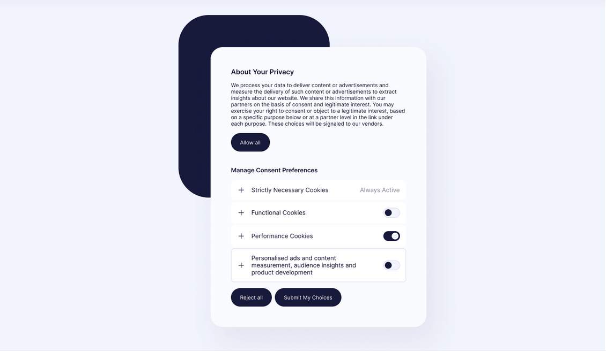

# Cookie preferences modal

Cookie preferences modal is my responsive build of the [cookie preferences modal](https://www.uidesigndaily.com/posts/figma-cookie-preferences-modal-cookies-settings-day-1581) UI design by  [Ildiko Gaspar](https://www.uidesigndaily.com/about). Check out the live version [here](http://cookie-preferences-modal.vercel.app/). And errm... the toggle buttons are functional. Well, go on, [click it](http://cookie-preferences-modal.vercel.app/). You know you want to.

## Available Scripts

In the project directory, you can run:

### `npm start`

Runs the app in the development mode.\
Open [http://localhost:3000](http://localhost:3000) to view it in your browser.

The page will reload when you make changes.\
You may also see any lint errors in the console.

### `npm test`

Launches the test runner in the interactive watch mode.\
See the section about [running tests](https://facebook.github.io/create-react-app/docs/running-tests) for more information.

### `npm run build`

Builds the app for production to the `build` folder.\
It correctly bundles React in production mode and optimizes the build for the best performance.
